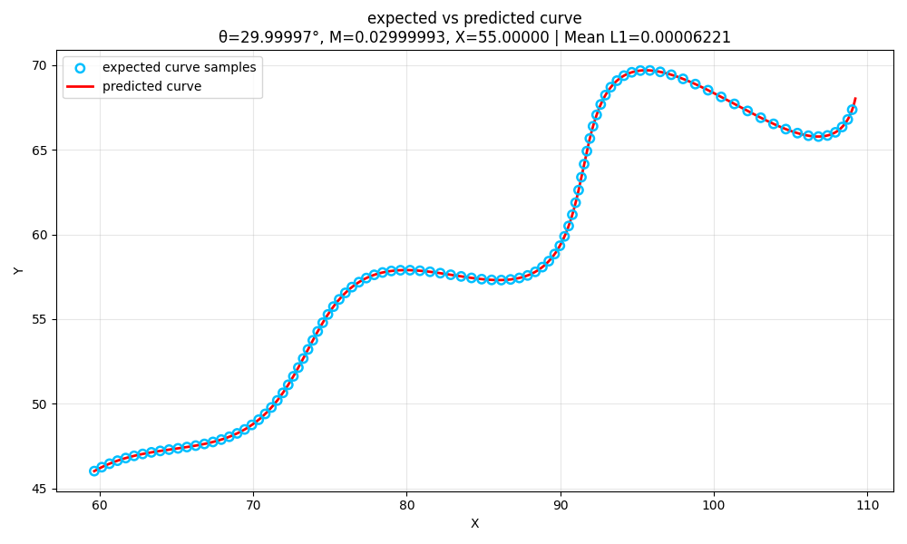

# Parametric Curve Parameter Estimation

## Overview

This repository contains my solution to the parametric curve parameter estimation problem.

The objective is to recover the unknown parameters $\theta$, $M$, and $X$ from a supplied set of $(x,y)$ coordinates generated from the curve:

```math
\begin{aligned}
x(t) &= t\cos\theta - e^{M|t|}\sin(0.3t)\sin\theta + X, \\
y(t) &= 42 + t\sin\theta + e^{M|t|}\sin(0.3t)\cos\theta.
\end{aligned}
```

The unknown parameters satisfy:

```math
0^\circ < \theta < 50^\circ,
\qquad
-0.05 < M < 0.05,
\qquad
0 < X < 100
```

with:

```math
6 < t < 60
```

The final recovered values are:

```math
\boxed{
\theta = 30^\circ,\qquad
M = 0.03,\qquad
X = 55
}
```

---

## Understanding the Problem

The provided CSV contains 1,500 observed $(x,y)$ points lying on the curve.

However, the corresponding parameter value $t$ for each coordinate is not provided.

This creates the main difficulty in the problem.

The mathematical model describes:

```math
x(t),\qquad y(t)
```

while the dataset only provides:

```math
(x_i,y_i)
```

Therefore, the CSV rows cannot directly be matched with uniformly generated curve points.

Before estimating $\theta$, $M$, and $X$, I first needed to understand the geometry of the curve and recover its missing parametric ordering.

---

## Exploratory Analysis

I began by inspecting the CSV and visualizing the supplied coordinates.

The $x$-$y$ scatter plot showed a smooth nonlinear curve with a visible oscillatory structure.

I then varied each parameter independently to understand its influence on the curve.

| Parameter | Observed Effect |
|---|---|
| $\theta$ | Changes the overall orientation of the curve |
| $M$ | Controls the growth or decay of the oscillation amplitude |
| $X$ | Translates the curve horizontally |
| $t$ | Represents progression along the parametric curve |

### Effect of $\theta$

Changing $\theta$ changes the overall orientation of the curve.

This behaviour is consistent with the repeated $\sin\theta$ and $\cos\theta$ terms in both coordinate equations.

### Effect of $M$

The parameter $M$ appears in:

```math
e^{M|t|}
```

It controls the amplitude envelope of the oscillatory component.

Positive values of $M$ increase the oscillation amplitude as $t$ increases, while negative values produce a decaying oscillation.

### Effect of $X$

The parameter $X$ is added only to the $x$-coordinate.

Therefore, changing $X$ shifts the complete curve horizontally without altering its intrinsic shape.

### Oscillatory Behaviour

I also studied:

```math
\sin(0.3t)
```

over the specified $t$-range.

Its repeating behaviour explains the oscillatory structure visible around the main direction of the observed curve.

The exploratory analysis suggested an important mathematical observation: the $\sin\theta$ and $\cos\theta$ terms follow the structure of a two-dimensional rotation.

This observation became the basis of the final methodology.

---

# Methodology

The solution follows four main stages:

```text
1. Inverse Transformation
   → Recover missing t values

2. PCHIP Interpolation
   → Reconstruct the reference curve at uniform t values

3. Differential Evolution
   → Search θ, M, and X

4. Uniform L1 Loss
   → Evaluate candidates and guide the optimizer
```

---

## 1. Inverse Transformation — Recovering the Missing $t$

The repeated oscillatory component is represented as:

```math
A=e^{M|t|}\sin(0.3t)
```

The original equations can then be rewritten as:

```math
\begin{aligned}
x-X &= t\cos\theta-A\sin\theta, \\
y-42 &= t\sin\theta+A\cos\theta.
\end{aligned}
```

These equations have the standard structure of a two-dimensional rotation:

```math
\begin{bmatrix}
x-X \\
y-42
\end{bmatrix}
=
\begin{bmatrix}
\cos\theta & -\sin\theta \\
\sin\theta & \cos\theta
\end{bmatrix}
\begin{bmatrix}
t \\
A
\end{bmatrix}
```

In other words, the hidden coordinates $(t,A)$ are rotated by $\theta$ to produce the observed shifted coordinates $(x-X,y-42)$.

Applying the inverse rotation gives:

```math
\boxed{
t=(x-X)\cos\theta+(y-42)\sin\theta
}
```

and:

```math
\boxed{
A=-(x-X)\sin\theta+(y-42)\cos\theta
}
```

For candidate values of $\theta$ and $X$, these equations map every observed $(x,y)$ point back to candidate $(t,A)$ coordinates.

Since the specified domain satisfies $t>0$:

```math
|t|=t
```

Therefore:

```math
A=e^{Mt}\sin(0.3t)
```

Rearranging:

```math
\frac{A}{\sin(0.3t)}=e^{Mt}
```

Taking the natural logarithm gives:

```math
\ln\left(
\frac{A}{\sin(0.3t)}
\right)=Mt
```

This provides a mathematical consistency condition for the inverse transformation.

For suitable values of $\theta$ and $X$, the recovered $t$ and $A$ values should follow this exponential-sinusoidal relationship.

A preliminary bounded search is used to identify a consistent inverse transformation and estimate an approximate $t$-value for every CSV point.

The recovered $t$-values are then used to restore the missing parametric order of the curve.

---

## 2. PCHIP Interpolation — Reconstructing a Uniform Reference Curve

After recovering approximate $t$-values, the observed points are sorted in increasing order of $t$.

The ordered samples can now be interpreted as observations of:

```math
x(t)\qquad\text{and}\qquad y(t)
```

However, the recovered $t$-values are not uniformly spaced.

To evaluate the reference curve at uniform parameter positions, I use PCHIP interpolation independently for $x(t)$ and $y(t)$.

```python
xe = PchipInterpolator(ts, xs, extrapolate=True)(tu)
ye = PchipInterpolator(ts, ys, extrapolate=True)(tu)
```

PCHIP provides a shape-preserving interpolation of the ordered curve samples.

A grid of exactly 1,500 uniformly spaced $t$-values is created strictly inside the specified domain:

```python
tu = np.linspace(6, 60, 1502)[1:-1]
```

The interpolated reference curve is evaluated on these values.

Therefore:

```math
(x_{e,i},y_{e,i})
```

represents the reconstructed reference curve at uniform parameter position $t_i$.

This stage converts the original unordered coordinate data into a uniformly sampled, parameter-aligned reference curve.

---

## 3. Differential Evolution — Searching $\theta$, $M$, and $X$

The next step is to search the allowed parameter space:

```math
0^\circ < \theta < 50^\circ,
\qquad
-0.05 < M < 0.05,
\qquad
0 < X < 100
```

I use Differential Evolution as the bounded optimizer.

For every candidate $(\theta,M,X)$, the original parametric equation is evaluated at the same uniform $t$-values used for the reconstructed reference curve.

The predicted curve is therefore:

```math
\begin{aligned}
x_{p,i}
&=
t_i\cos\theta
-
e^{M|t_i|}
\sin(0.3t_i)
\sin\theta
+
X, \\
y_{p,i}
&=
42
+
t_i\sin\theta
+
e^{M|t_i|}
\sin(0.3t_i)
\cos\theta.
\end{aligned}
```

The optimizer repeatedly generates candidate parameter sets and evaluates how closely their predicted curves match the reconstructed reference curve.

The final parameter search is implemented as:

```python
result = differential_evolution(
    l1_pdf,
    [(0, 50), (-0.05, 0.05), (0, 100)],
    seed=42,
    tol=1e-10,
    maxiter=500
)
```

A fixed random seed is used to make the optimization reproducible.

Differential Evolution performs the parameter search, while the L1 objective determines which candidate provides the better curve fit.

---

## 4. Uniform L1 Loss — Guiding the Optimizer

Both the reconstructed reference curve and the candidate predicted curve are evaluated at the exact same uniform $t$-values.

Therefore, every reference point has a directly corresponding predicted point:

```math
(x_{e,i},y_{e,i})
\longleftrightarrow
(x_{p,i},y_{p,i})
```

The coordinate-wise L1 distance for one corresponding point pair is:

```math
d_i=
|x_{e,i}-x_{p,i}|
+
|y_{e,i}-y_{p,i}|
```

The total objective is:

```math
L_1(\theta,M,X)
=
\sum_{i=1}^{1500}
\left(
|x_{e,i}-x_{p,i}|
+
|y_{e,i}-y_{p,i}|
\right)
```

In code:

```python
return np.sum(abs(xe - xp) + abs(ye - yp))
```

A smaller L1 value represents a closer curve fit.

The optimization process can be summarized as:

```text
Candidate (θ, M, X)
        ↓
Generate predicted curve
        ↓
Evaluate at uniform t values
        ↓
Calculate L1 distance
        ↓
Lower L1 = better candidate
        ↓
Differential Evolution continues searching
```

The L1 loss acts as the fitness objective that guides Differential Evolution toward the best-fitting values of $\theta$, $M$, and $X$.

---

## Complete Pipeline

```text
CSV (x, y)
      ↓
Inverse Transformation
      ↓
Recover Missing t
      ↓
Sort Curve Points
      ↓
PCHIP Reconstruction
      ↓
Uniform t Sampling
      ↓
Differential Evolution Search
      ↓
Uniform L1 Evaluation
      ↓
Best θ, M, X
```

The key idea is to first convert the unordered $(x,y)$ dataset into a parameter-aligned reference curve.

Once the reference and predicted curves are evaluated at identical uniform $t$-values, the unknown parameters can be optimized directly using coordinate-wise L1 distance.

---

# Results

The optimization produced:

| Parameter | Estimated Value | Rounded Value |
|---|---:|---:|
| $\theta$ | $29.9999726588^\circ$ | $30^\circ$ |
| $M$ | $0.0299999327$ | $0.03$ |
| $X$ | $54.9999985658$ | $55$ |

Therefore, the final recovered parameters are:

```math
\boxed{
\theta=30^\circ,\qquad
M=0.03,\qquad
X=55
}
```

The local uniform-grid comparison produced:

```math
\text{Total L1}=0.0933196112
```

and:

```math
\text{Mean L1}=6.2213\times10^{-5}
```

The total L1 is the accumulated coordinate-wise distance across all 1,500 uniformly sampled point pairs.

The mean L1 represents the average coordinate-wise L1 difference per sampled point.

The L1 values reported here are from the uniform-grid implementation used in this repository.

---

## Visual Validation



The blue markers represent uniformly sampled reconstructed reference points.

The red line represents the predicted curve generated using the estimated parameters.

The two curves overlap closely across the sampled parameter domain, which is consistent with the low uniform-grid L1 loss.

---

# Final Parametric Equation

The rounded angle is:

```math
30^\circ=\frac{\pi}{6}\approx0.5235987756
```

Substituting the recovered parameters into the original equation gives:

```math
\begin{aligned}
x(t)
&=
t\cos(0.5235987756)
-
e^{0.03|t|}
\sin(0.3t)
\sin(0.5235987756)
+
55, \\
y(t)
&=
42
+
t\sin(0.5235987756)
+
e^{0.03|t|}
\sin(0.3t)
\cos(0.5235987756).
\end{aligned}
```

for:

```math
6<t<60
```

### LaTeX / Desmos Format

```text
\left(
t\cos(0.5235987756)
-e^{0.03\left|t\right|}\sin(0.3t)\sin(0.5235987756)+55,
42+t\sin(0.5235987756)
+e^{0.03\left|t\right|}\sin(0.3t)\cos(0.5235987756)
\right)
```

---

## Project Structure

```text
FLAM_APP/
├── codes/
│   ├── comparison.py
│   ├── csv_explore.py
│   ├── curve_generator.py
│   ├── solver.py
│   └── parameter_analyse/
│       ├── m_exploration.py
│       ├── t_exploration.py
│       ├── theta_exploration.py
│       └── x_exploration.py
├── data/
│   └── xy_data.csv
├── plots/
│   └── final_curve_comparison.png
├── requirements.txt
└── README.md
```

### Main Files

- `codes/csv_explore.py` — inspection and visualization of the supplied coordinate data.
- `codes/curve_generator.py` — implementation of the provided parametric curve.
- `codes/parameter_analyse/` — individual study of the behaviour of $\theta$, $M$, $X$, and $t$.
- `codes/solver.py` — inverse transformation, PCHIP reconstruction, uniform L1 objective, and Differential Evolution search.
- `codes/comparison.py` — final reference-versus-predicted curve visualization.

---

## Running the Project

### Install Dependencies

```bash
pip install -r requirements.txt
```

### Run the Solver

From the repository root:

```bash
python3 codes/solver.py
```

Expected output:

```text
theta = 29.999972658755222
M = 0.029999932724411604
X = 54.999998565788985
total uniform L1 = 0.09331961117312915
mean uniform L1 = 6.221307411541943e-05
```

### Generate the Comparison Plot

```bash
python3 codes/comparison.py
```

The generated visualization is saved as:

```text
plots/final_curve_comparison.png
```

---

## Conclusion

The main challenge in this problem was not only estimating $\theta$, $M$, and $X$, but also handling the missing $t$-parameterization of the supplied coordinate data.

The rotational structure of the equation was inverted to recover approximate $t$-values and restore the curve order.

PCHIP interpolation was then used to reconstruct a uniformly sampled reference curve.

Differential Evolution searched the permitted parameter space, while the coordinate-wise uniform L1 distance evaluated and guided each candidate solution.

The final recovered values are:

```math
\boxed{
\theta=30^\circ,\qquad
M=0.03,\qquad
X=55
}
```